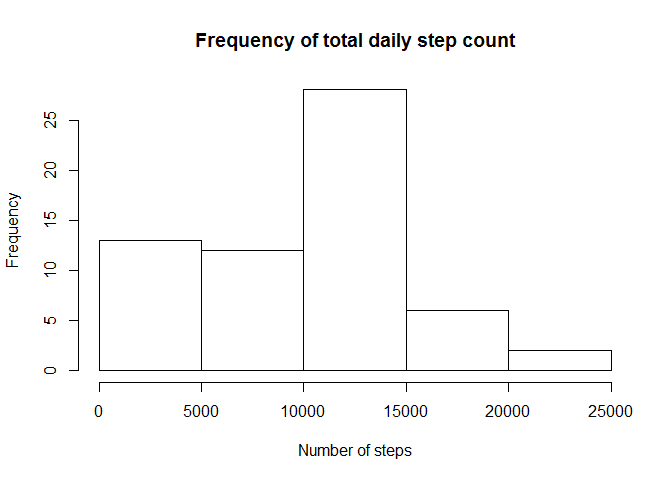
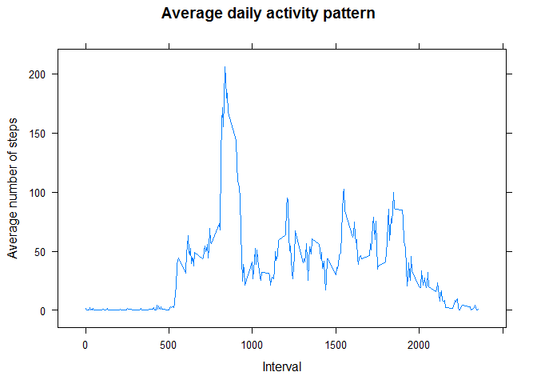
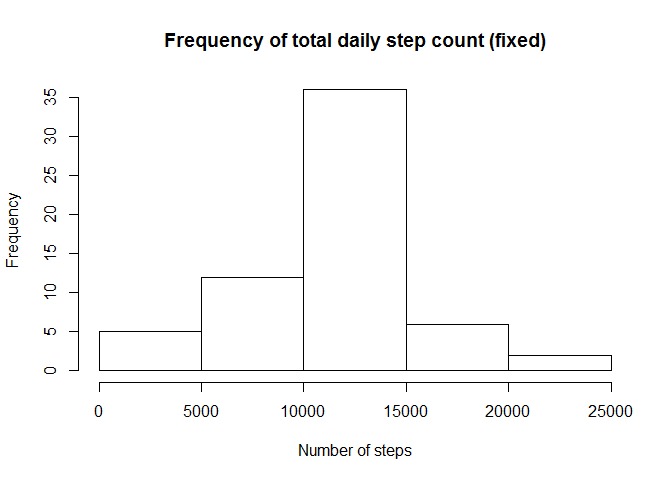
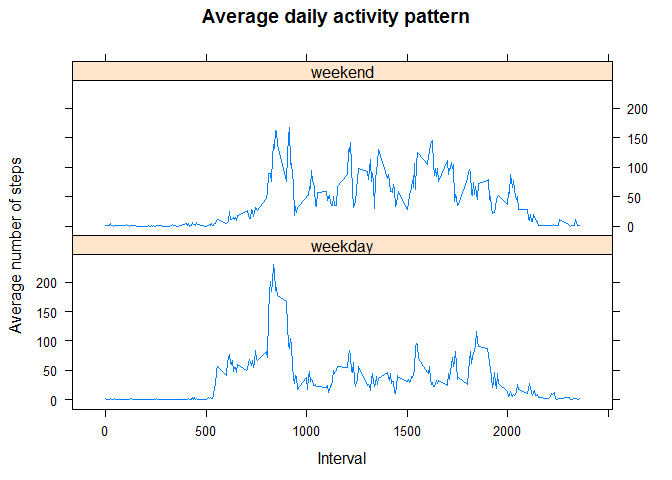

# RepData_PeerAssessment1
franceshuisman  
April 12, 2016  


## Part 1
### Reading and preprocessing the data

First load dependencies, in this case dplyr and lattice.


```r
library(dplyr)
```

```
## Warning: package 'dplyr' was built under R version 3.2.3
```

```
## 
## Attaching package: 'dplyr'
```

```
## The following objects are masked from 'package:stats':
## 
##     filter, lag
```

```
## The following objects are masked from 'package:base':
## 
##     intersect, setdiff, setequal, union
```

```r
library(lattice)
```

Then read in the data and convert the 'date' column to date format. This is
necessary for later processing.


```r
d <- read.csv("repdata_data_activity/activity.csv")
d <- mutate(d, date = as.Date.factor(date))
```


## Part 2
### Steps taken per day

Group and summarise the step data by date.


```r
perday <- d %>% group_by(date) %>% summarise(steps = sum(steps, na.rm = TRUE))
```

Plot daily totals as a histogram.


```r
with(perday, hist(steps, xlab = "Number of steps", 
                  main = "Frequency of total daily step count"))
```



Calculate the mean and median of the daily totals.


```r
mean(perday$steps)
```

```
## [1] 9354.23
```

```r
median(perday$steps)
```

```
## [1] 10395
```


## Part 3
### Average daily activity pattern

Group and summarise the step data by interval.


```r
perinterval <- d %>% group_by(interval) %>% summarise(steps = mean(steps, 
                                                             na.rm = TRUE))
```

Plot a time series of the average number of steps per interval.


```r
p4 <- xyplot(steps ~ interval, data = perinterval, type = "l", 
             xlab = "Interval", ylab = "Average number of steps", 
             main = "Average daily activity pattern")
print(p4)
```



Find the 5-minute interval with the maximum average number of steps.


```r
with(perinterval, interval[which(steps == max(steps))])
```

```
## [1] 835
```


## Part 4
### Impute missing values

Calculate the number of rows with NA values.


```r
sum(is.na(d$steps))
```

```
## [1] 2304
```

Fill in the missing data. In this step, NA values in the *steps* column are
replaced with the mean number of steps for that interval.


```r
dfixed <- d %>% group_by(interval) %>% mutate(stepsfixed = replace(steps,
                                is.na(steps), mean(steps, na.rm = TRUE)))
```

As before, group and summarise step data by date, and then plot daily totals
as a histogram.


```r
perdayfixed <- dfixed %>% group_by(date) %>% 
        summarise(stepsfixed = sum(stepsfixed))
with(perdayfixed, hist(stepsfixed, xlab = "Number of steps", 
                  main = "Frequency of total daily step count (fixed)"))
```



Calculate the mean and median of the new daily totals.


```r
mean(perdayfixed$stepsfixed)
```

```
## [1] 10766.19
```

```r
median(perdayfixed$stepsfixed)
```

```
## [1] 10766.19
```

These numbers are identical, as any days without step data were imputed to have 
mean results, resulting in a number of counts of statistically average results. 


## Part 5
### Weekday/weekend activity patterns

Assign *weekday* and *weekend* factors based on the day of the week.


```r
dfixed <- dfixed %>% mutate(daytype = ifelse(weekdays(date) 
                        %in% c("Saturday", "Sunday"), "weekend", "weekday"))
```

Group and summarise data by interval and the new *daytype* factors.


```r
bydaytype <- dfixed %>% group_by(daytype, interval) %>% 
        summarise(steps = mean(stepsfixed))
```

Plot separate time series of the average number of steps per interval for 
weekdays and weekends.


```r
p8 <- xyplot(steps ~ interval | daytype, data = bydaytype, type = "l", 
             layout = c(1, 2), xlab = "Interval", 
             ylab = "Average number of steps", 
             main = "Average daily activity pattern")
print(p8)
```


